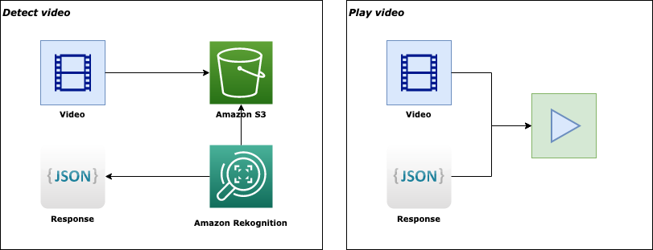

# Rekognition tracking boxes

This project uses Amazon Rekognition to get bounding boxes around detected objects.
The Rekognition response is then used to play the video and overlay the boxes.
In addition, in this sample the bounding box become red if its too close to another box.

## Prerequisites 
 - python 3.x
 - Aws account with correct rights and cli configuration
 
## Set up
 - clone the repository
 - run `pip install -r requirements.txt` inside the repository

## Usage
Run the video detection process with:  
`python detect_video.py -v ./VIDEO_PATH/YUR_VIDEO.mp4 -b S3_BUCKET_NAME`

Play the video with:
`python play.py -v ./VIDEO_PATH/YUR_VIDEO.mp4 -d ./labels/YUR_VIDEO.mp4.json`  
You can pass an optional parameter to increase the frame rate as: 
`python play.py -v ./VIDEO_PATH/YUR_VIDEO.mp4 -d ./labels/YUR_VIDEO.mp4.json -f 25`
## Process explained
The `detect_video.py` file upload your video file on S3 and calls Amazon Rekognition, then save the respomnse to a `json` file inside the `labels` folder.

The `play.py` file parse the response creating the bounding boxes and overlay the results over the video.

## Limitations

This initial version doesn't take care of the perspective of the scene, so the distance is calculate against a 2D plane. 
The distance in pixel can be changed inside the `play.py` file (see `MAX_DISTANCE` variable)

The Rekognition call doesn't support response pagination. Can be easily implemented with further calls using the `NextToken` response parameter ([see official documentation](https://boto3.amazonaws.com/v1/documentation/api/latest/reference/services/rekognition.html#Rekognition.Client.get_label_detection))
