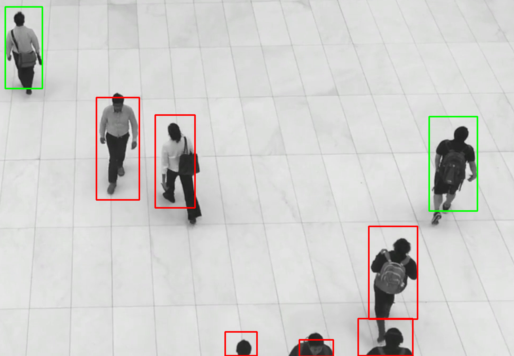
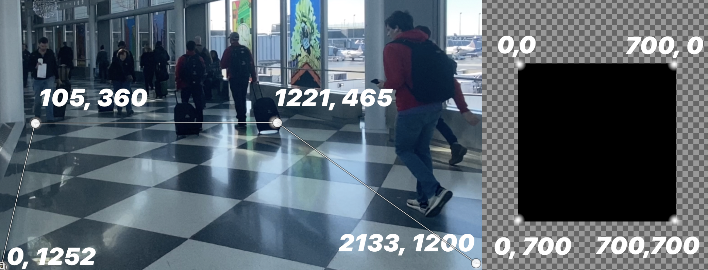
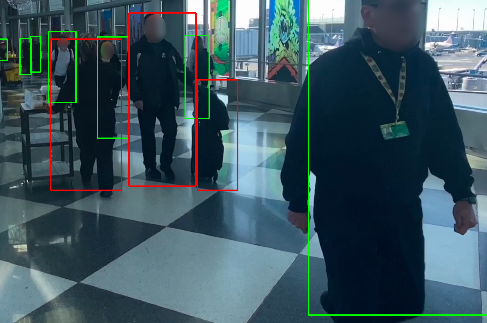

# Rekognition tracking boxes

This project uses Amazon Rekognition to get bounding boxes around detected objects.
The Rekognition response is then used to play the video and overlay the boxes.
In addition, in this sample the bounding box become red if its too close to another box.



## Prerequisites 
 - python 3.x
 - [AWS account](https://aws.amazon.com/resources/create-account/) with correct rights and cli configuration
 
## Set up
 - clone the repository
 - run `pip install -r requirements.txt` inside the repository

## Usage
Run the video detection process with:  
`python detect_video.py -v ./VIDEO_PATH/YUR_VIDEO.mp4 -b S3_BUCKET_NAME`

Play the video with:  
`python play.py -v ./VIDEO_PATH/YUR_VIDEO.mp4 -d ./labels/YUR_VIDEO.mp4.json`  
You can pass an optional parameter to increase the frame rate as:  
`python play.py -v ./VIDEO_PATH/YUR_VIDEO.mp4 -d ./labels/YUR_VIDEO.mp4.json -f 25`

To make the distance feature precise in case the video is not taken from a perpendicular top view you need to map the coordinate of the video with the coordinate of a plane.

## Mapping coordinates
You can use the `map.py` file which creates a JSON file with mapping coordinates.  
Usage: `python map.py -v YOR_VIDEO_FILE.mp4`  
Click with your mouse to create points, press `s` to save to a `coordinates.json` file or  press `q` to quit from the window.
The result is a json file as following:
```
{
    "camera" : [[105,360], [0,1252], [1221, 465], [2133,1200]],
    "plane":[[0,0], [700,0], [700, 700], [0,700]]
}
```


Finally you can run the `play` script as:  
`python play.py -d labels/VIDEO.mp4.json -v video/VIDEO.mp4 -c coordinates.json -t 200`  
Where `-t` identifies the threshold distance between objects.

In the below image you can see how the 3D spacial distance is correctly respected.



## Process explained
The `detect_video.py` file upload your video file on S3 and calls Amazon Rekognition, then save the respomnse to a `json` file inside the `labels` folder.

The `play.py` file parse the response creating the bounding boxes and overlay the results over the video.


## Limitations

The Rekognition call doesn't support response pagination. Can be easily implemented with further calls using the `NextToken` response parameter ([see official documentation](https://boto3.amazonaws.com/v1/documentation/api/latest/reference/services/rekognition.html#Rekognition.Client.get_label_detection))
